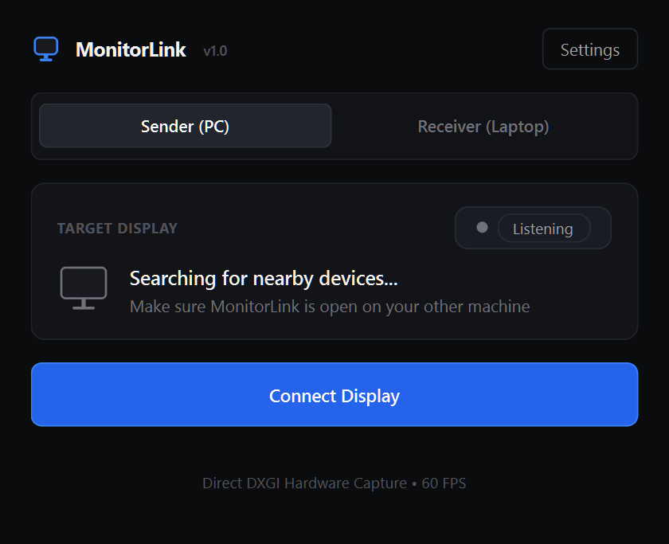
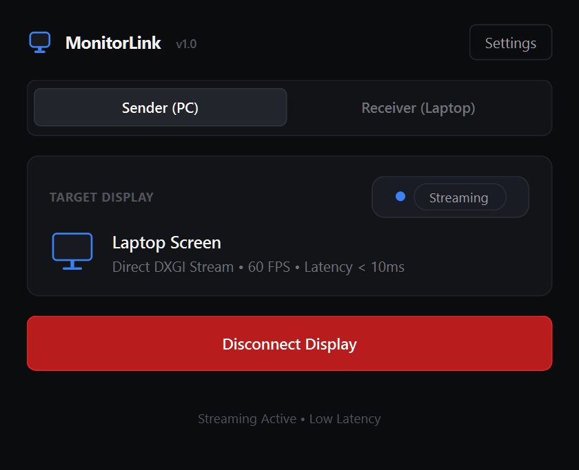

# MonitorLink

**Ultra-low-latency secondary display streaming between Windows machines with dedicated monitor standby.**

Turn any spare Windows laptop into a high-refresh wireless or wired secondary monitor for your PC. Powered by DirectX DXGI Desktop Duplication and the Microsoft IddCx driver pipeline.

[](https://github.com/Amirtheshwaran/MonitorLink/stargazers)
[](https://github.com/Amirtheshwaran/MonitorLink/network/members)
[](https://github.com/Amirtheshwaran/MonitorLink/issues)
[](https://github.com/Amirtheshwaran/MonitorLink/discussions)
[](https://github.com/Amirtheshwaran/MonitorLink/milestones)
[](LICENSE)
[](#requirements-and-platform)


---

<p align="center">
  
  &nbsp;&nbsp;
  
</p>

---

## Why MonitorLink?

Most existing solutions for using a laptop as a secondary screen are either proprietary, laggy, bloated with background services, or require purchasing HDMI dummy plugs:

| Feature | MonitorLink | Spacedesk | Miracast ("Project to this PC") | Deskreen |
| :--- | :---: | :---: | :---: | :---: |
| **Open Source** | **Yes (MIT)** | No (Proprietary) | No (Windows only) | Yes (GPL-3.0) |
| **Capture Pipeline** | **DirectX DXGI (60 FPS)** | Virtual Display Driver | Miracast Wi-Fi Direct | Electron / WebRTC |
| **Latency** | **< 15ms (Wi-Fi) / < 5ms (Wired)** | ~30–50ms | Inconsistent (Stutters) | ~50–80ms |
| **Setup Complexity** | **1-Click Auto-Discovery** | Multi-step installer | Frequent pairing failures | Web browser + QR code |
| **Direct Cable Support** | **Yes (Gigabit Ethernet/USB)** | Manual IP setup | No (Wi-Fi Direct only) | Local network only |
| **Dedicated Standby** | **Yes (`SetThreadExecutionState`)** | No | Full desktop | Browser window |
| **True Extended Desktop** | **Included IddCx Driver** | Proprietary driver | Supported | Requires dummy plug |

---

## Quick start

### 1. Host machine (PC)
1. Run `run_pc.bat` (or `python MonitorLink.py --mode pc`).
2. The sender starts an mDNS/UDP beacon and opens a local WebSocket endpoint (`0.0.0.0:8765`).

### 2. Client machine (Laptop)
1. Run `run_laptop.bat` (or `python MonitorLink.py --mode laptop`).
2. The laptop automatically discovers the host on your Wi-Fi or wired connection.

### 3. Connect and disconnect
- **To Link**: Click **Connect Display** on either device. The laptop immediately enters an edge-to-edge fullscreen monitor state, hides the local cursor, and renders the PC display feed at up to 60 FPS.
- **To Delink**: Click **Disconnect Display** on the host, or press **`Esc`** on the client laptop. The laptop closes the receiver canvas and returns to its prior desktop state with all local windows and power timeouts preserved.

---

## Architecture and stream pipeline

```
+-------------------------------------------------------------------------+
|                              HOST (PC)                                  |
|                                                                         |
|  [ D3D11 / Desktop Duplication ]  --->  [ TurboJPEG Compression ]      |
|  (IddCx Virtual Monitor / DXGI)         (cv2.imencode, 60 FPS)          |
|                                                    |                    |
|                                         [ WebSocket Server ]            |
|                                         (port 8765: /stream, /control)  |
+----------------------------------------------------+--------------------+
                                                     |
                                (Local Wi-Fi or Point-to-Point Cable)
                                                     |
+----------------------------------------------------+--------------------+
|                            CLIENT (Laptop)                              |
|                                                                         |
|  [ WebSocket Client ]             --->  [ QImage Direct Blit ]          |
|  (Binary JPEG payload)                  (QPainter edge-to-edge canvas)  |
|                                                    |                    |
|  [ SetThreadExecutionState ]            [ Bi-Directional Delink ]       |
|  (ES_DISPLAY_REQUIRED)                  (Esc hotkey / host control)     |
+-------------------------------------------------------------------------+
```

| Component | Implementation | Notes |
| --- | --- | --- |
| Screen capture | DirectX 11 DXGI Desktop Duplication API | Zero desktop memory copy overhead; falls back to Win32 GDI if running in isolated sessions |
| Compression | OpenCV Hardware-optimized JPEG | Frame drop policy ensures real-time pacing with zero accumulated socket buffer latency |
| Transport | Asynchronous binary WebSockets | Port 8765. Frame header + raw payload with ping/pong latency tracking |
| Discovery | UDP subnet broadcasts | Port 8766. Broadcasts machine role, IP interfaces, and hostnames every 1.0s |
| Receiver UI | PyQt6 with hardware-accelerated paint event | Borderless `WindowStaysOnTopHint`, auto-hiding cursor (1.5s timeout), floating HUD |
| Power management | Win32 `SetThreadExecutionState` | Requests `ES_SYSTEM_REQUIRED` and `ES_DISPLAY_REQUIRED` while linked; cleans up on delink |

---

## Display modes and Virtual Display Driver

Windows requires an enumerated display device to provide an **Extended Desktop** workspace. If your host PC only has a single physical monitor, you have two options:

1. **Mirroring (Primary Display)**: Directly duplicates `\\.\DISPLAY1` to the laptop screen with no driver installation required.
2. **Extended Desktop (Virtual Display Driver)**: Uses the bundled Microsoft IddCx (Indirect Display Driver) implementation to create a genuine `\\.\DISPLAY2` adapter in Windows Display Settings.

### Installing the Virtual Display Driver

An automated script and signed driver binaries are provided in `driver/`:

```powershell
# Run from an elevated PowerShell prompt:
powershell.exe -NoProfile -ExecutionPolicy Bypass -File .\install_driver.bat
```

Once installed, Windows recognizes a virtual display adapter (`Root\MttVDD`). You can arrange its relative position (left, right, above, or below your main screen) in Windows Display Settings (`ms-settings:display`). MonitorLink will automatically detect the second monitor and target it for streaming.

---

## Standby state and delink behavior

When linked, the client laptop enters a dedicated display receiver state:
- **Display backlight and system activity**: The application calls `SetThreadExecutionState(ES_CONTINUOUS | ES_SYSTEM_REQUIRED | ES_DISPLAY_REQUIRED)`. This keeps the panel powered and prevents modern standby sleep transitions without modifying global power schemes.
- **Input and cursor**: The client cursor is suppressed when stationary. An optional input passthrough mode allows remote mouse manipulation over the control socket.
- **State restoration**: When delinked (via host UI, laptop HUD, or `Esc`), the application:
  1. Releases the fullscreen widget.
  2. Resets thread execution state flags via `SetThreadExecutionState(ES_CONTINUOUS)`.
  3. Restores standard Windows cursor visibility and focus to the active shell.

---

## Physical connection realities (HDMI vs. Point-to-Point Cable)

### Why direct HDMI cabling does not work
Laptops are engineered with **HDMI Output (Tx)** controllers connected to their internal GPU. They cannot accept incoming TMDS/FRL video signals on that port. Connecting an HDMI cable between a desktop graphics card and a laptop HDMI port will not deliver video to the laptop panel.

### Supported wired configurations
- **Direct Ethernet cable**: Connect a standard Cat5e/Cat6 cable between the PC and Laptop RJ-45 ports. Windows configures a link-local APIPA address (`169.254.x.x`). MonitorLink detects the wired adapter and prioritizes it for sub-5ms latency and full gigabit bandwidth.
- **USB-C Data / USB Tethering**: Connecting over USB with RNDIS / USB Ethernet provides a dedicated local network interface.
- **USB HDMI Video Capture Dongle**: If physical HDMI output from your PC is strictly required, plug the PC HDMI cable into a USB UVC video capture dongle (~$10) plugged into the laptop.

---

## Requirements and platform

- **Operating System**: Windows 10 (version 1903 or newer) or Windows 11.
- **Python**: Python 3.10 to 3.13.
- **Network**: Local Wi-Fi network with UDP broadcast enabled, or direct Ethernet / USB connection.
- **Permissions**: Standard user rights for streaming and client receiver. Administrator rights are required only if installing the optional IddCx Virtual Display Driver.

---

## Manual execution and building

### Setup environment

```powershell
python -m venv .venv
.\.venv\Scripts\pip install -r requirements.txt
```

### Run

```powershell
# Run on PC:
.\.venv\Scripts\python.exe MonitorLink.py --mode pc

# Run on Laptop:
.\.venv\Scripts\python.exe MonitorLink.py --mode laptop
```

### Build standalone executable

To generate a standalone portable build without requiring Python on the client laptop:

```powershell
.\build_exe.bat
```

The compiled binary and dependencies will be written to `dist\MonitorLink\MonitorLink.exe`.

---

## 🌟 Community & Contributing

If MonitorLink saved you from buying an expensive portable monitor, **please consider starring the repository** on GitHub! It helps the project reach more users and developers.

- 💬 **Discussions**: Have questions, latency test results, or setup ideas? Join the [GitHub Discussions](https://github.com/Amirtheshwaran/MonitorLink/discussions)!
- 🐛 **Issues**: Found a bug or compatibility issue with your GPU or Windows build? Open an [Issue](https://github.com/Amirtheshwaran/MonitorLink/issues).
- 🤝 **Pull Requests**: Pull requests are welcome for new encoder optimizations, input capture improvements, and localized guides.

---

## License

[MIT](LICENSE). Virtual Display Driver binaries are based on Microsoft's IddCx indirect display driver samples.
